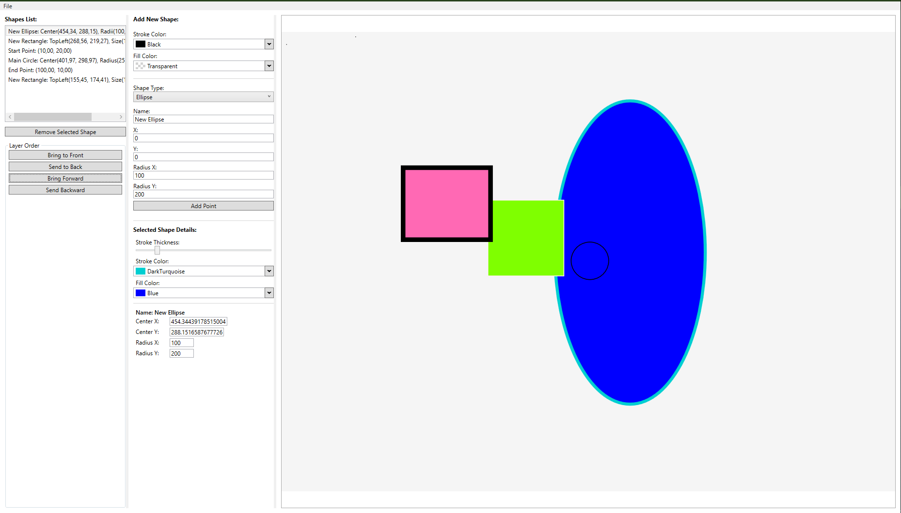
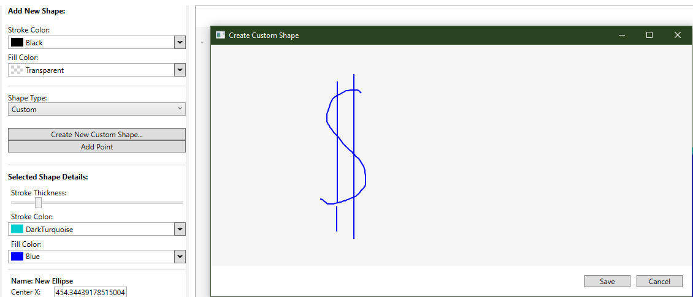
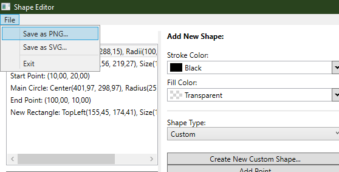

# ShapeEditor - 2D Vector Graphics Editor



## 📝 Overview

**ShapeEditor** is a feature-rich 2D vector graphics editor developed using **WPF (Windows Presentation Foundation)** and C#. This project demonstrates a deep understanding of desktop application development, adhering to the **MVVM (Model-View-ViewModel)** architectural pattern for a clean, scalable, and testable codebase.


## ✨ Features

The editor supports a wide range of functionalities, from basic shape creation to advanced user interactions and file operations.

### Core Drawing & Object Management
- **Multiple Shape Types:** Create and manage various geometric objects:
  - Points
  - Circles
  - Rectangles
  - Ellipses
- **Custom Shape Drawing:** A dedicated modal editor allows users to draw their own freeform shapes with the mouse, which are then saved as reusable objects.
  
- **Object Properties:** Full control over visual properties for any selected shape:
  - **Stroke:** Change color and thickness.
  - **Fill:** Apply solid color fills, with a user-friendly color picker.
- **Z-Order Control:** Easily manage object layering with "Bring to Front," "Send to Back," "Bring Forward," and "Send Backward" commands.

### Advanced Canvas Interaction
- **Direct Manipulation:** All shapes on the canvas can be interactively selected and moved using the mouse.
- **MVVM-driven Interaction:** All canvas interactions are handled cleanly through **WPF Behaviors**, keeping the Views and ViewModels decoupled.
- **Adaptive Viewport:** The canvas viewport intelligently scales with the window size using a `Viewbox`, ensuring a consistent and responsive user experience.
- **Clipping:** Shapes that extend beyond the canvas boundaries are automatically clipped from view.

### File Operations
- **Project Persistence:** Ability to save and load the entire scene (a collection of shapes) in a project file. *(Note: This feature is planned or can be implemented via JSON/XML serialization).*
- **Vector & Raster Export:** Export the canvas to industry-standard formats.
  - **PNG Export:** Save a high-resolution raster snapshot of the canvas.
  - **SVG Export:** Save a resolution-independent vector file, preserving all shapes, colors, and properties. This file can be opened in other vector editors like Inkscape or Adobe Illustrator.
  

## 🛠️ Technical Implementation

This project is built on a solid technical foundation, emphasizing best practices in WPF development.

- **Architecture:** **MVVM (Model-View-ViewModel)**
  - **Models:** Plain C# objects (`GeometricObject`, `CircleObject`, etc.) representing the data, with `INotifyPropertyChanged` for data binding.
  - **Views:** XAML-defined user interface (`MainWindow`, `CustomShapeEditorWindow`). The code-behind is minimal, used only for view-specific logic like managing window dialog results.
  - **ViewModels:** The "brain" of the application (`MainViewModel`). Contains all application logic, state, and commands, completely decoupled from the UI.
- **Commands:** Uses the `RelayCommand` pattern (`ICommand`) to connect UI actions (button clicks) to logic in the ViewModel.
- **Data Binding:** Extensive use of WPF's powerful data binding system to synchronize the UI with the ViewModel's state.
- **Data Templates (`DataTemplate`):** Dynamically renders different shapes on the canvas and in property panels, allowing for easy extension with new shape types.
- **Value Converters:** Used to translate data between the ViewModel and the View (e.g., `NullToVisibilityConverter`, `NegativeValueConverter`).
- **Behaviors:** Implements attached behaviors (`Microsoft.Xaml.Behaviors.Wpf`) to handle complex UI interactions (like mouse drawing and dragging) without breaking the MVVM pattern.
- **Dependency Injection (DI):** The structure is DI-friendly, allowing for services (like file saving) to be injected for better testability.
- **Third-party Libraries:**
  - `Extended.Wpf.Toolkit`: For UI controls like the `ColorPicker`.
  - `Svg.Skia`: A powerful library for creating and manipulating SVG files from C# objects.

## 🚀 How to Run

1. Clone the repository:
   ```bash
   git clone https://github.com/YourUsername/ShapeEditor.git
